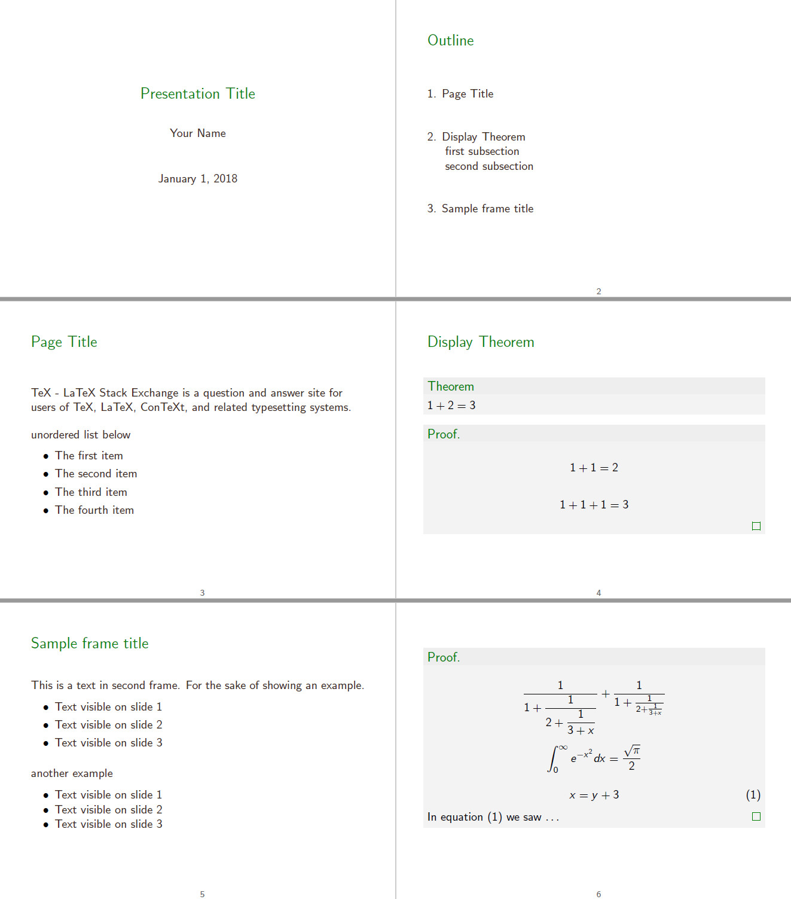
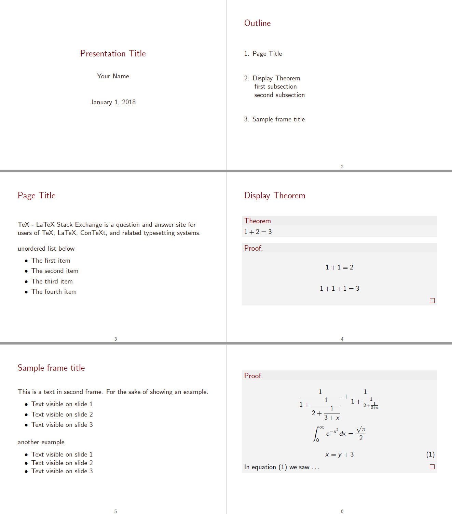

# BeamerTheme

## Introduction

This project include two themes, long and short version. When you are making a long slide, a sidebar with table of content and the current section you are talking about is necessary. Then, you can write your file based on `template_long.tex`, otherwise `template_short.tex`.

`.pdf` files in `examples` folder and demos below show the baisc style of this beamer theme. 

## Usage

You can run `example_short.tex` and `example_long.tex` directly to see the demos.

When writing your own files, just input one of the template files and define colors you like to inherit this theme. Just like what `example_*.tex`s do.

For example

```
\documentclass[aspectratio=169]{beamer}

\input{template_long.tex}

\colorlet{main}{green!50!black}

%-------------------main body-------------------------%
\author{Your Name}
\title{Presentation Title}
\begin{document}


\end{document}
```

(Hint: Make sure that template_long.tex and your tex file is in the same folder.)

Of course, you cna modify the theme based on the two template files to extend new styles. For each element you want to modify, just google it! There are a lot of answers to help you.

## Demos

### long green version


### long red version


### short green version



### short red version

