# BeamerTheme

## Introduction

The value of this project is as follows

- A beamer theme focusing on simple color and clear navigation. 
- The color and navigation can be changed easily. And I will talk about the tricks to set them up.
- A content tex file to test the beauty of other themes.

The code has passed with pdflatex and Xelatex.

## Demos

Here, I will show two main kinds of output with different aspect ratio(ratio of width to height). You can change the theme color and the way of navigation conveniently. See more [examples](examples) here.

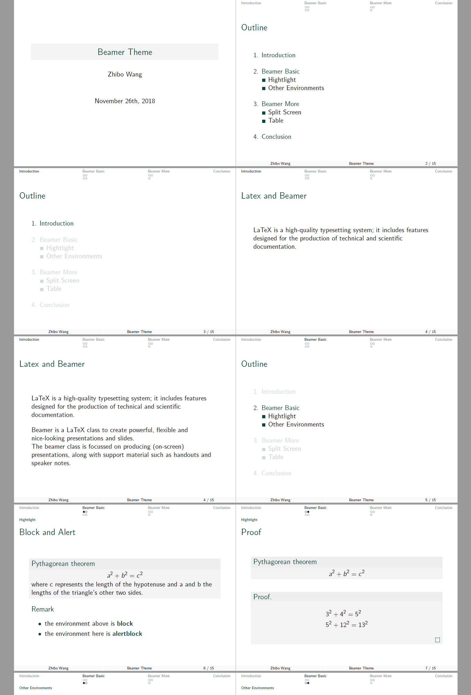

[simple source](simple.tex)

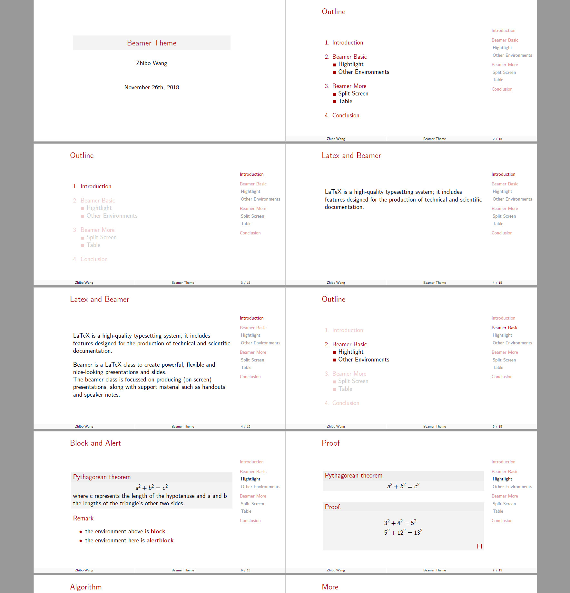

[sidebar source](bar169.tex)

## Usage

The main file is `beamerthemeSimple.sty`. Make sure it is in the same folder as your tex file(Or [global path](https://tex.stackexchange.com/questions/1137/where-do-i-place-my-own-sty-or-cls-files-to-make-them-available-to-all-my-te/214080)). You can use it just like other themes.

```latex
\usetheme{Simple}
```

Here is a complete example to use it.

```latex
\documentclass{beamer}
    \usepackage[english]{babel}
    
    % customize your own color and navigation
    \usetheme[RGB={12 72 66}]{Simple} % color
    \useoutertheme{tree}              % navigation
    
    \author{Your Name}
    \title{Your title}
    \date{November 29th, 2018}

    \begin{document}
        \frame[plain]{\titlepage}
        \section{Introduction}
        \begin{frame}
            \frametitle{Latex and Beamer}
            LaTeX is a high-quality typesetting system; 
            it includes features designed for the production of 
            technical and scientific documentation.
        \end{frame}
    \end{document}
```

You can change the color and the way of navigation as you like. I will talk about the two topics in detail.

## Color

There will be only one unified color in the slides with this theme. You can change the overall color by setting RGB.

```latex
\usetheme[RGB={12 72 66}]{Simple}
```

Or HEX

```latex
\usetheme[HTML=A30000]{Simple}
```

Here are some colors that I like. You can see the output in [examples](examples).

```
HTML=096148      % green
RGB={12 72 66}   % bluegreen
HTML=8D742A      % brown
RGB={163 0 0}    % red
```
You can search for beautiful colors [here](http://nipponcolors.com). 

Or just generate three RGB values randomly by heart. You may find the output is surprisingly beautiful if the three value are all below 100.

## Navigation

For a long-time presentation, a suitable navigation is necessary. I selected four ways of navigation with different advantages.(**Focus on the top of each slide next.**)

### 1. split

All sections and subsections for the current section are displayed on the top of each page. It contains a lot of information. But it will become too fat if there are too many sections. Maybe deviding the presentation into several parts with command `\part` will help.

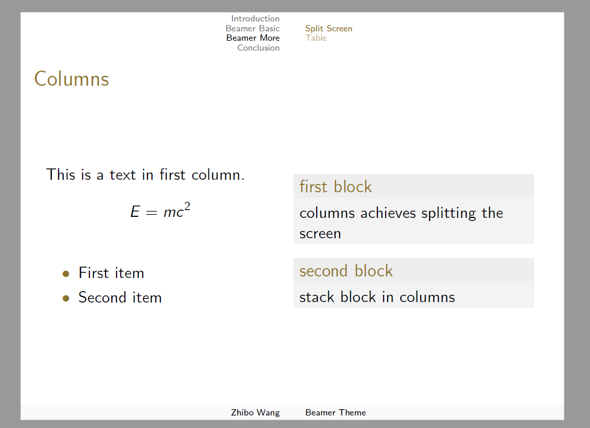

Load this navigation by

```
\useoutertheme{split}
```

### 2. tree

It is concise for only displaying the current section and subsection. It's recommended when the structure of this presentation is clear itself.

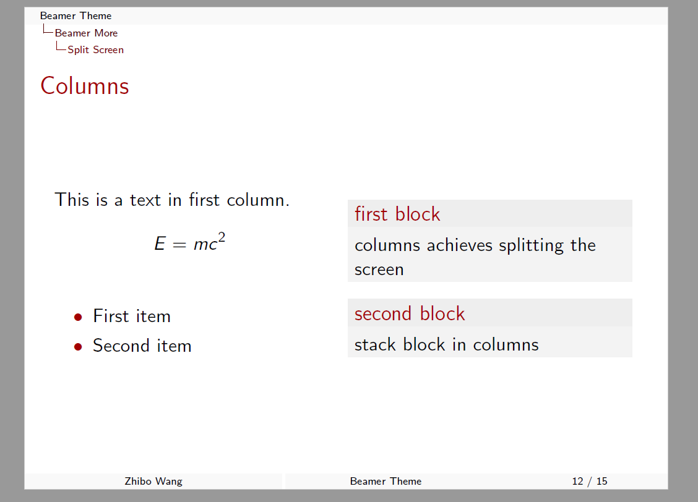

Load this navigation by

```
\useoutertheme{tree}
```

### 3. miniframes

This navigation displays all sections and the current subsection. More importantly, the navigation bullets can show the progress of each subsection.

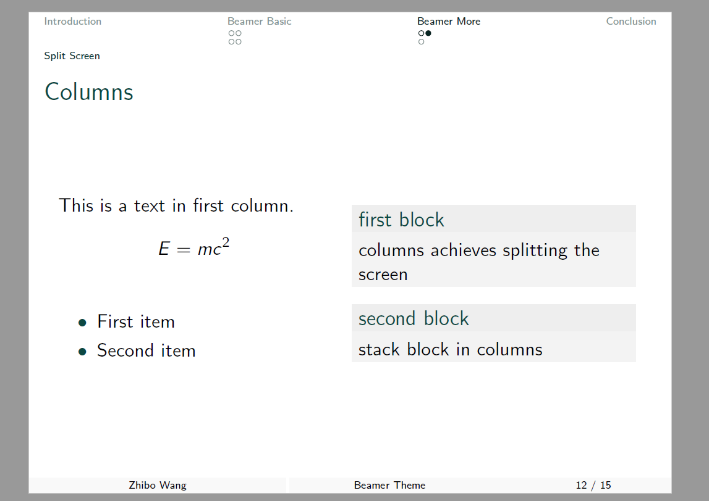

Load this navigation by

```
\useoutertheme{miniframes}
```

However, the bullets placed in two lines may confuse those who have never used it. Therefore, I recommend to use this when there are no subsections so that the bullets will be placed in one line. Or you can set to make the navigation bullets only work for section.

```
\documentclass[compress]{beamer}
\useoutertheme[subsection=false]{miniframes}
```

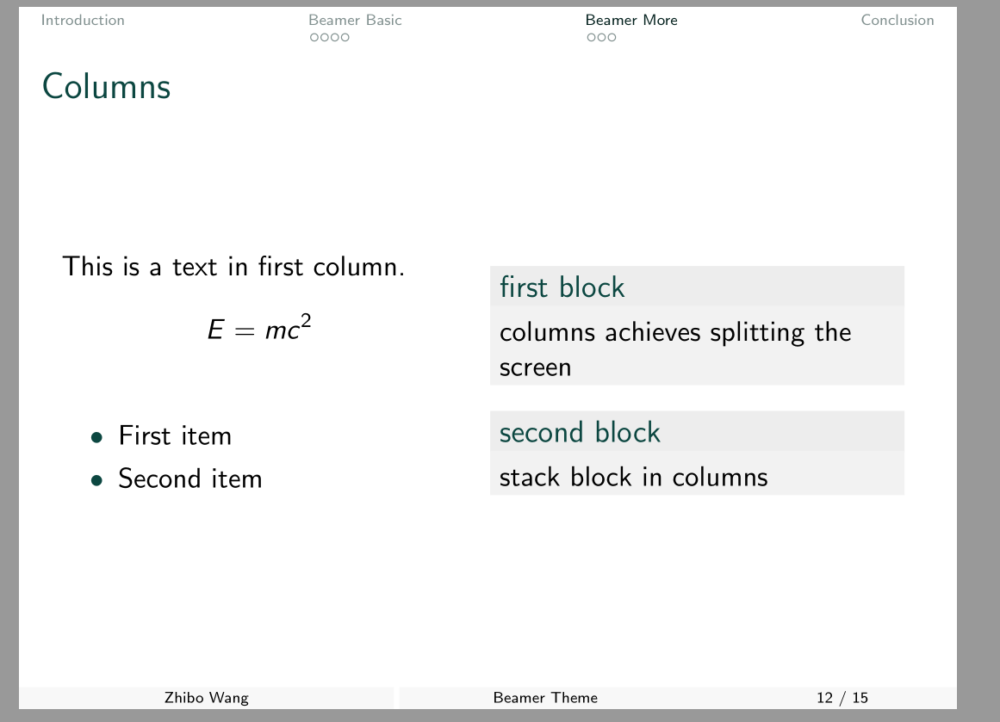

Another point to note is that the outertheme **miniframes and Xelatex are not compatible**. So you need to use pdflatex to achieve this effect.

### 4. sidebar

It will display all sections and subsections on the right bar and contains most information comparing with ways before. But it is not proper if there are too many topics to display.

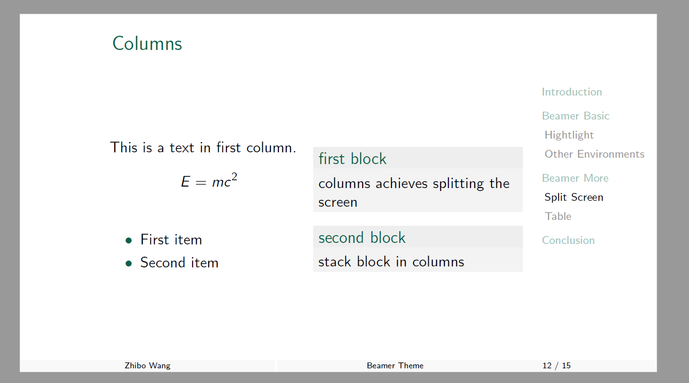

Here is the usage of this theme which is kind of different from before.

```
\documentclass[aspectratio=169]{beamer}
    \usepackage[english]{babel}
    \usetheme[RGB={12 72 66}]{Bar169}

    \author{Your Name}
    \title{Your Title}
    \date{November 29th, 2018}

    \begin{document}
        \frame[plain]{\titlepage}
        \section{Introduction}
        
        \begin{frame}
            \frametitle{Latex and Beamer}
            LaTeX is a high-quality typesetting system; 
            it includes features designed for the production of 
            technical and scientific documentation.
        \end{frame}
    \end{document}
```

Several points to pay attention to

- Specify the ratio at the beginning `aspectratio=169`.
- Use theme `Bar169` rather than `Simple`.
- Don't need to specify the outertheme.

Other things are the same. You can change the color in the same way.

## Test other themes

The `content.tex` contents many elements and enough sections to test what a theme looks like. 

### Built-in themes

Build a `test.tex` file in this folder and fill in the code below.
```
\documentclass{beamer}
    \usetheme{Berlin}
    \usecolortheme{beaver}
    \input{pkgs.tex}
    \author{Your Name}
    \title{Beamer Theme}

    \begin{document}
        \input{content.tex}
    \end{document}
```
You will get 

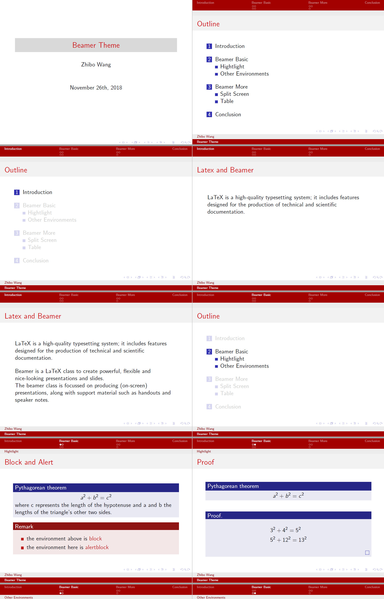

### Download themes

For example, we test [this theme](https://github.com/matze/mtheme)

```
\documentclass{beamer}
    \usetheme{metropolis}
    \input{pkgs.tex}
    \author{Your Name}
    \title{Beamer Theme}

    \begin{document}
        \input{content.tex}
    \end{document}
```

You will get 

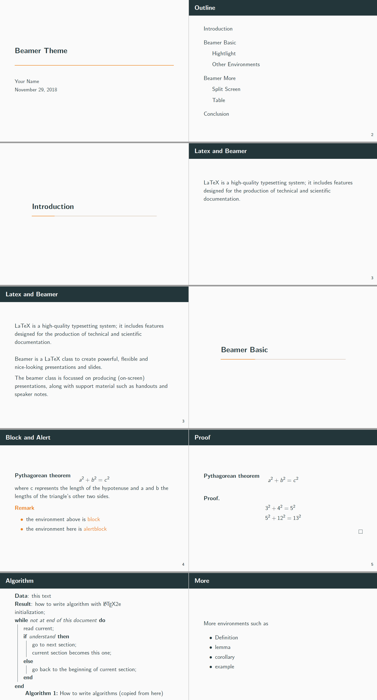

I have to say that it is quite beautiful! But without navigation, it may be more appropriate to be used when having a short presentation.

However, you can achieve most of this effect by changing my 'simple' theme.

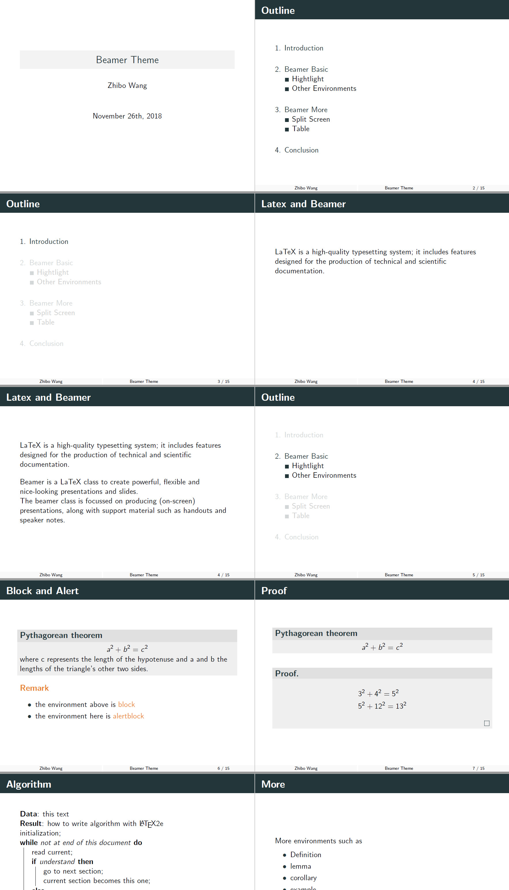

------------------

**Besides, it is more flexible to add the navigation.**

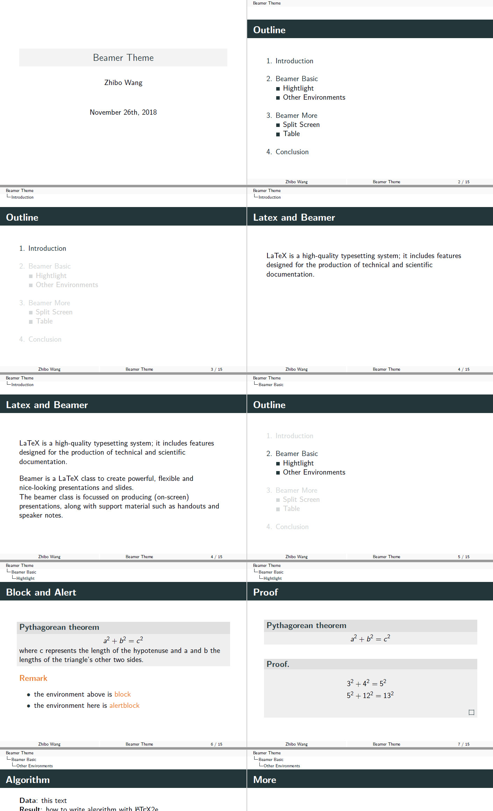